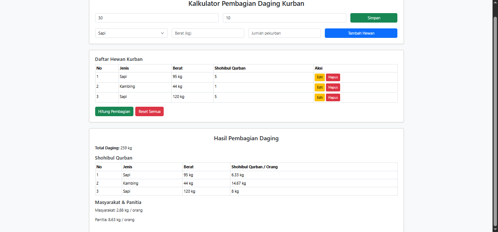

# 🐄 Kalkulator Pembagian Daging Kurban

Aplikasi **Kalkulator Pembagian Daging Kurban** adalah aplikasi berbasis web yang dibuat sebagai tugas mata kuliah **Pemrograman Kreatif (PK)**.

Aplikasi ini dibuat untuk membantu panitia atau pengelola kurban melakukan perhitungan pembagian daging secara lebih cepat, terstruktur, dan mengurangi kesalahan perhitungan manual.

---

## 📌 Latar Belakang

Dalam pelaksanaan kurban, jumlah hewan, berat daging, jumlah shohibul qurban, jumlah masyarakat/mustahik, dan jumlah panitia dapat berbeda-beda.

Jika perhitungannya dilakukan secara manual, proses tersebut dapat membutuhkan waktu dan berpotensi menimbulkan kesalahan.

Oleh karena itu, aplikasi ini dibuat untuk mengubah proses tersebut menjadi perhitungan digital. Pengguna cukup memasukkan data hewan kurban dan jumlah penerima, kemudian sistem akan menghitung hasil pembagian secara otomatis.

---

## 🎯 Tujuan

Project ini dibuat untuk:

- Menerapkan konsep pemrograman dalam menyelesaikan permasalahan nyata.
- Membuat proses perhitungan pembagian daging kurban menjadi lebih praktis.
- Mengurangi kesalahan dalam perhitungan manual.
- Menampilkan hasil pembagian secara terstruktur dan mudah dipahami.
- Memenuhi tugas mata kuliah **Pemrograman Kreatif (PK)**.

---

## ✨ Fitur

- ➕ Menambahkan data hewan kurban.
- 🐄 Mendukung beberapa jenis hewan kurban seperti sapi, kambing, dan domba.
- ⚖️ Memasukkan berat masing-masing hewan.
- 👥 Memasukkan jumlah shohibul qurban.
- 👨‍👩‍👧‍👦 Menentukan jumlah masyarakat/mustahik.
- 👨‍💼 Menentukan jumlah panitia.
- 🧮 Menghitung pembagian daging secara otomatis.
- ✏️ Mengedit data hewan.
- 🗑️ Menghapus data hewan.
- 🔄 Mereset seluruh data.
- 📊 Menampilkan hasil pembagian dalam bentuk tabel.

---

## 🖥️ Tampilan Aplikasi

Berikut adalah contoh tampilan hasil perhitungan dari aplikasi:



---

## ⚙️ Cara Kerja

Pengguna terlebih dahulu memasukkan jumlah masyarakat/mustahik dan jumlah panitia.

Contoh:

- Masyarakat/Mustahik: **30 orang**
- Panitia: **10 orang**

Kemudian pengguna dapat menambahkan beberapa hewan kurban beserta berat dan jumlah shohibul qurban.

Contoh data:

| No | Jenis Hewan | Berat | Shohibul Qurban |
|---:|---|---:|---:|
| 1 | Sapi | 95 kg | 5 orang |
| 2 | Kambing | 44 kg | 1 orang |
| 3 | Sapi | 120 kg | 5 orang |

Setelah data dimasukkan, pengguna menekan tombol **Hitung Pembagian** dan sistem akan menghasilkan perhitungan secara otomatis.

---

## 🧮 Contoh Perhitungan

### 1. Total Daging

Dari data pada contoh:

```text
95 kg + 44 kg + 120 kg = 259 kg
```

Sehingga:

**Total Daging = 259 kg**

---

### 2. Bagian Shohibul Qurban

Dalam aplikasi ini, bagian shohibul qurban dihitung sebesar **1/3 dari berat masing-masing hewan**, kemudian dibagi berdasarkan jumlah shohibul qurban pada hewan tersebut.

#### Sapi 95 kg — 5 Shohibul

```text
95 ÷ 3 = 31,67 kg
31,67 ÷ 5 = 6,33 kg/orang
```

Hasil:

**6,33 kg/orang**

#### Kambing 44 kg — 1 Shohibul

```text
44 ÷ 3 = 14,67 kg
14,67 ÷ 1 = 14,67 kg/orang
```

Hasil:

**14,67 kg/orang**

#### Sapi 120 kg — 5 Shohibul

```text
120 ÷ 3 = 40 kg
40 ÷ 5 = 8 kg/orang
```

Hasil:

**8 kg/orang**

---

### 3. Bagian Masyarakat/Mustahik dan Panitia

Setelah bagian shohibul qurban dihitung, sisa daging dialokasikan untuk masyarakat/mustahik dan panitia.

Pada contoh:

```text
Total daging = 259 kg
Bagian shohibul ≈ 86,33 kg
Sisa daging ≈ 172,67 kg
```

Sisa tersebut dibagi menjadi dua bagian yang sama besar:

```text
Masyarakat/Mustahik ≈ 86,33 kg
Panitia              ≈ 86,33 kg
```

#### Masyarakat/Mustahik

Jumlah masyarakat:

**30 orang**

Per orang:

```text
86,33 ÷ 30 ≈ 2,88 kg/orang
```

Hasil:

**2,88 kg/orang**

#### Panitia

Jumlah panitia:

**10 orang**

Per orang:

```text
86,33 ÷ 10 ≈ 8,63 kg/orang
```

Hasil:

**8,63 kg/orang**

> Catatan: angka pada tampilan dapat mengalami sedikit perbedaan karena pembulatan angka desimal.

---

## 💡 Nilai Kreatif Project

Nilai kreatif dari project ini terletak pada penerapan logika pemrograman untuk menyelesaikan permasalahan yang dapat ditemui dalam kegiatan nyata.

Aplikasi tidak hanya melakukan penjumlahan berat daging, tetapi juga mempertimbangkan beberapa variabel seperti:

- jenis hewan,
- berat masing-masing hewan,
- jumlah shohibul pada setiap hewan,
- jumlah masyarakat/mustahik,
- jumlah panitia.

Dengan demikian, pengguna dapat memasukkan kombinasi data hewan yang berbeda dan mendapatkan hasil pembagian secara otomatis.

---

## 🛠️ Teknologi

Project ini dikembangkan menggunakan teknologi web, antara lain:

- **PHP** — logika aplikasi dan proses perhitungan.
- **MySQL** — penyimpanan data.
- **HTML** — struktur halaman.
- **CSS** — tampilan antarmuka.
- **Bootstrap** — membantu membuat tampilan antarmuka yang sederhana dan responsif.
- **JavaScript** — mendukung interaksi pada halaman.

## 📂 Konsep Input dan Output

### Input

Pengguna memasukkan:

```text
Jumlah masyarakat/mustahik
Jumlah panitia
Jenis hewan
Berat hewan
Jumlah shohibul qurban
```

### Process

Sistem melakukan:

```text
Menghitung total berat
        ↓
Menghitung bagian shohibul
        ↓
Menghitung sisa daging
        ↓
Mengalokasikan untuk masyarakat/mustahik
        ↓
Mengalokasikan untuk panitia
        ↓
Menghitung bagian per orang
```

### Output

Sistem menampilkan:

- Total daging.
- Bagian setiap shohibul qurban berdasarkan hewan.
- Bagian masyarakat/mustahik per orang.
- Bagian panitia per orang.

---

## 🎓 Mata Kuliah

**Pemrograman Kreatif (PK)**

Project ini dibuat sebagai implementasi tugas mata kuliah Pemrograman Kreatif dengan pendekatan pembuatan aplikasi yang memiliki fungsi dan manfaat praktis.

---

## 👨‍💻 Author

**Redi Grandis Vinata**

Email: redigrandisvinata21@gmail.com

---

